<h1 align="center">Tanya Nair 🦑</h1>

  AI technologist @ Chewy · AI research @ JHU CLSP 
  Electrical & Computer Engineering @ Johns Hopkins

---

## About Me
- 🛰️ Studying Electrical & Computer Engineering at Johns Hopkins, working across software, ML, and hardware
- 🐾 Currently on co-op at Chewy's Data & AI Innovation Team in Seattle, building AI tooling for pet travel
- 🗣️ Researching NLP and multilingual LLMs at the Center for Language and Speech Processing (CLSP)
- 🦾 Automating accessibility remediation for higher education IT

## Tech Stack

  

  <b>Languages:</b> Python · Java · C/C++ · R 
  <b>AI / ML:</b> PyTorch · LangChain · Neo4j · n8n · Claude Code · spaCy 
  <b>Dev:</b> React · Flask · Scrapy 
  <b>Infra & hardware:</b> AWS · Jenkins · Git · Linux · KiCad

